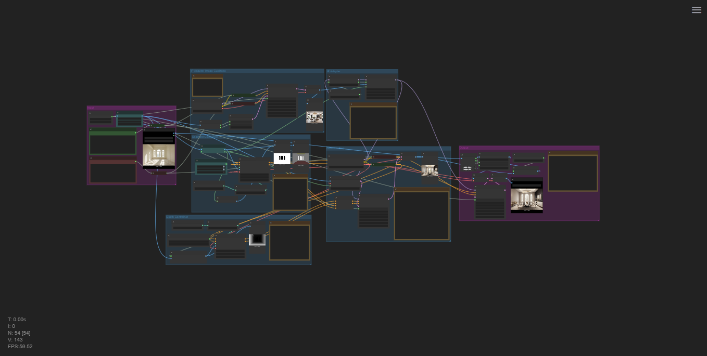

# 🛋️ Interior Design for ComfyUI v2.0

This project adapts the original pipeline from  
[StableDesign: 2nd place solution for the Generative Interior Design 2024 competition](https://huggingface.co/spaces/MykolaL/StableDesign)  
to work **natively and fully inside ComfyUI**, leveraging modern custom nodes and a modular architecture.

Learn more about the original method in this [Medium article](https://medium.com/@melgor89/generative-interior-design-challenge-2024-2nd-place-solution-6338f19f6fe3).

---

## ✅ Key Features

- **Fully restructured for ComfyUI compatibility**
- Includes 3 custom nodes developed specifically for this repository:
  - `"Interior Design Segmentator"`
  - `"Image Normalize"`
  - `"Control Items"` 
- Uses additional advanced custom nodes:
  - [Depth Anything V2](https://github.com/DepthAnything/Depth-Anything-V2)
  - [ComfyUI_IPAdapter_plus](https://github.com/cubiq/ComfyUI_IPAdapter_plus)
- Reimplements only the **necessary components** from the original pipeline, such as:
  - **Semantic segmenter** using [`openmmlab/upernet-convnext-small`](https://huggingface.co/openmmlab/upernet-convnext-small)
- Supports standard ComfyUI workflows with **ControlNet and IP Adapter integration**
- Compatible with other workflows and custom models
- Inference is significantly faster than the original pipeline (test the workflow and compare).

---

## 🧱 Pipeline Overview

- The idea was to use as many nodes from the ComfyUI core as possible. However, for certain tasks, I had to rely on custom nodes or adapt my own nodes to stay as faithful as possible to the original pipeline, or alternatively, use dependencies from other custom node repositories.
- Uses the **same base models** as the original StableDesign pipeline
- Includes **custom ControlNet models**:
  - `controlnet_depth`
  - `own_controlnet` (segmentation)
- These ControlNets, along with the depth map and segmentation map, are passed into the **UNet** of the diffusion model
- Final step includes **refinement with latent noise injection and up/down-scaling**(because of the size limitation of the original pipeline)

---

## 📁 Example Workflow

An example workflow is included in this repository:  
[`stable-design-for-comfyui.json`](./workflow/stable-design-for-comfyui.json)

You can load it directly into ComfyUI to test or extend the pipeline.

---

## 📦 Installation & Dependencies

This node is available on [ComfyUI Manager](https://github.com/ltdrdata/ComfyUI-Manager)  
You must also install the following custom nodes manually if not yet available:

- [Depth Anything V2](https://github.com/DepthAnything/Depth-Anything-V2)
- [ComfyUI_IPAdapter_plus](https://github.com/cubiq/ComfyUI_IPAdapter_plus) *(note: unmaintained)*
- [ComfyMath](https://github.com/evanspearman/ComfyMath)

---

## 🔧 Upcoming Features

- **Expansion of Control Items**: Add support for more semantic regions and control inputs to increase flexibility and detail in generation.
- **Evaluation of CLIP Conditioning**: Reassess the combination of positive and negative CLIP embeddings in ControlNet to verify if results match the original pipeline's behavior.
- **Custom IP Adapter Node**: Implement a native IP Adapter node to replace the current dependency on `ComfyUI_IPAdapter_plus`, which is currently unmaintained.

---

## 🧪 License & Acknowledgements

Original pipeline by MykolaL ([StableDesign on Hugging Face](https://huggingface.co/spaces/MykolaL/StableDesign))  
This adaptation reuses only essential logic, converted to full ComfyUI-compatible workflow format.

---

feel free to open issues and PRs
